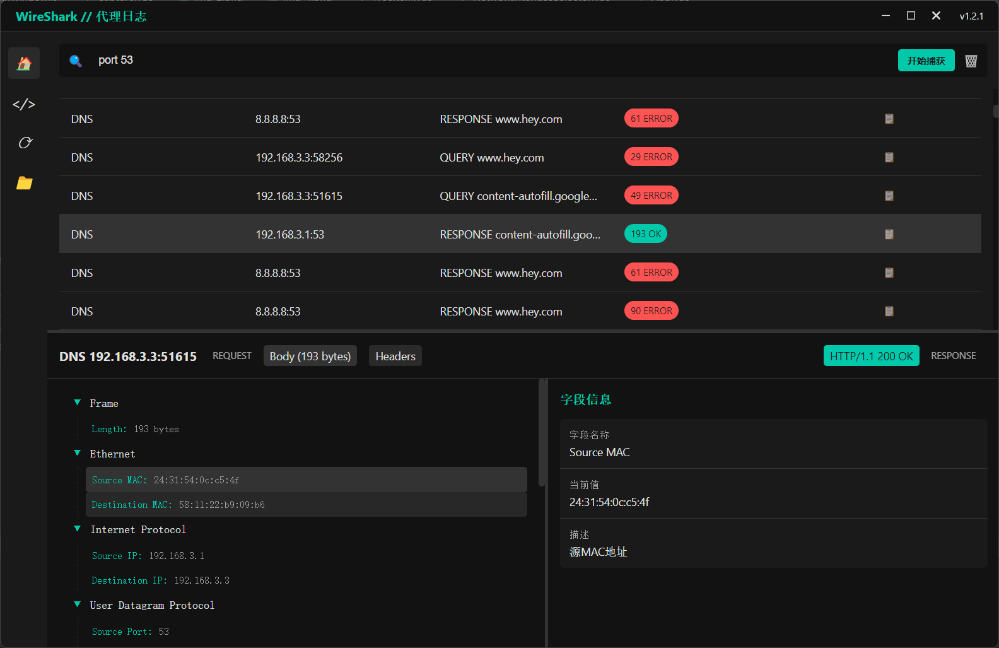

# VueShark

*English Version | [中文版](README.zh.md)*

VueShark is a network packet analysis tool based on Electron and Vue. Its goal is to gradually align with Wireshark’s capabilities while simplifying the developer experience, offering a user-friendly UI, and providing automated setup for capturing packets. With VueShark, you can quickly establish a packet capture environment on your desktop, visually inspect network traffic data, perform traffic interruption and forwarding, and even attempt HTTPS man-in-the-middle (MITM) analysis. VueShark aims to be a cross-platform, automated, easily extensible, and modern network analysis tool.

## Examples

## Key Features

- **Cross-Platform Support**: Designed to run on major operating systems (Windows, macOS, Linux), ensuring a consistent experience across different environments.
- **Vue Frontend Framework**: Built with Vue 3 and Vue Router, the UI is streamlined, efficient, and easily customizable.
- **Electron Integration**: Avoid cumbersome setup. One-click startup for instant packet capture and analysis.
- **Automated Configuration**: Planned support for automatic installation of dependencies like npcap, lowering the entry barrier.
- **Multi-Protocol and Extensibility**: Targets feature parity with Wireshark, including extensive protocol parsing and advanced operations like traffic hooks, interruption, and HTTPS MITM decryption.
- **Optimized UI Interactions**: Real-time visualization and filtering of network data via IPC communications between the frontend and backend.

## Milestones

VueShark’s mission is to continuously enhance its feature set to match that of Wireshark, evolving into a comprehensive network analysis solution. Short-term and long-term milestones include:

1. **Foundational Features**
   - [ ] Resolve electron-builder packaging issues for cross-platform distribution.
   - [ ] Support automated npcap installation to minimize manual setup.
   - [ ] Implement packet list and detail views in Vue, aligning with Wireshark’s basic UI and interactions.

2. **Aligning with Wireshark**
   - [ ] Add traffic hook and interruption features, allowing users to filter, block, or forward specific traffic.
   - [ ] Support HTTPS MITM analysis for encrypted traffic.
   - [ ] Parse and display more protocols (TCP, UDP, HTTP/2, TLS, DNS, etc.).
   - [ ] Introduce packet statistics and analysis charts (traffic timeline, protocol distribution, IP heatmaps, etc.).

3. **Advanced Features & Cross-Platform Optimization**
   - [ ] Provide complete cross-platform configuration and automated packet capture setup for Windows, macOS, and Linux.
   - [ ] Adopt a plugin architecture, enabling developers to extend protocol parsing and add additional analysis functionalities.
   - [ ] Add data saving and playback functionalities for offline analysis of historical packet captures.
   - [ ] Implement multi-language support (Chinese, English, and more) for international reach.
   - [ ] Explore AI/ML-based traffic analysis to flag anomalous activities.

4. **Ambitions**
   - [ ] Achieve full parity with Wireshark’s protocol parsing capabilities, making VueShark a modernized alternative.
   - [ ] Offer a highly intuitive toolkit for security research, performance tuning, and educational demonstrations.
   - [ ] Foster a vibrant community to develop and maintain an ever-growing ecosystem around VueShark.

## Acknowledgments

- Thanks to [Wireshark](https://www.wireshark.org/) for setting the industry standard in network analysis and providing inspiration.
- Thanks to [Electron](https://www.electronjs.org/) and [Vue](https://vuejs.org/) projects for simplifying desktop app frontend development.
- Thanks to [Methy](https://juejin.cn/post/7359467530186522663) for insights on electron pcap.
- Thanks to all open-source projects and contributors that provide ideas and technical foundations in network analysis.

If you find VueShark interesting, please consider giving it a [Star](https://github.com/MaskerPRC/vueshark/stargazers) and help us grow.

We welcome Issues and PRs—let’s work together to make VueShark the next powerful cross-platform packet analysis tool!
