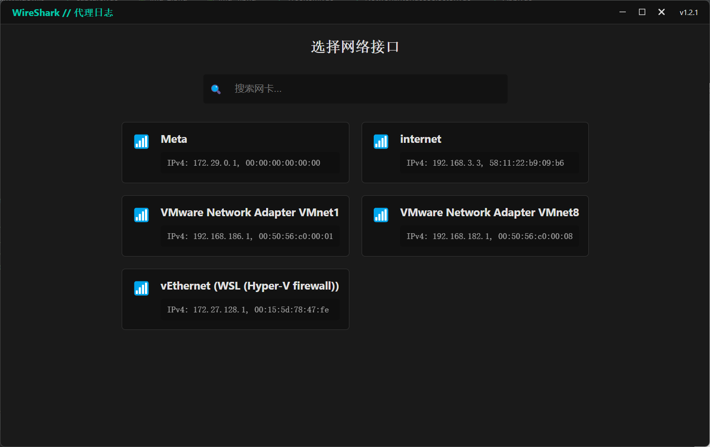

# VueShark

VueShark 是一个基于 Electron 与 Vue 的网络数据包分析工具，目标是逐步向 Wireshark 看齐，并在简化开发者体验的同时，提供友好的 UI 以及自动化的抓包配置流程。通过它，你可以在桌面端快速搭建抓包环境、可视化查看网络数据包内容、执行流量中断与转发、并尝试实现 HTTPS 的中间人代理解析。VueShark 致力于打造一个跨平台、自动化、易拓展、界面现代的抓包分析工具。

## 案例

## 产品特色

- **跨平台支持**：计划支持主流操作系统（Windows, macOS, Linux），方便在不同环境下使用。
- **Vue 前端框架**：使用 Vue3 与 Vue Router 构建前端 UI，界面简洁高效，可灵活定制与扩展。
- **Electron 集成**：无需繁琐的环境搭建，一键启动即可进行网络抓包与分析。
- **自动化配置**：计划支持自动安装 npcap 等依赖组件，降低用户入门门槛。
- **多协议与多功能扩展**：目标支持与 Wireshark 一致的协议解析与分析功能，提供更多操作如流量 hook、中断、HTTPS 中间人代理解析。
- **UI 交互优化**：通过前后端 IPC 通信，让用户在 UI 界面直观查看、筛选与分析数据包。

## 里程碑 (Milestone)

VueShark 的宗旨是逐渐支持与 Wireshark 一致的功能，不断进化成为一个强大的网络分析工具。以下是我们的短期与长期里程碑：

1. **基础功能完善**
    - [ ] 修复 electron-builder 的打包问题，以便跨平台分发。
    - [ ] 支持全自动安装 npcap，减少用户手动安装依赖的麻烦。
    - [ ] 使用 Vue 实现数据包列表与详情展示页面，对标 Wireshark 基础 UI 与交互。

2. **功能逐步对齐 Wireshark**
    - [ ] 支持流量 hook 与中断功能，允许对特定流量进行过滤、阻断或转发。
    - [ ] 支持 HTTPS 中间人代理解析，进行加密流量分析。
    - [ ] 对更多协议进行解析与展示，包括 TCP, UDP, HTTP/2, TLS, DNS 等。
    - [ ] 增加数据包统计与分析图表（流量时间线、协议分布、IP 热度图等）。

3. **高级功能与跨平台优化**
    - [ ] 完整支持 Windows、macOS、Linux 的自动化配置与抓包环境搭建。
    - [ ] 提供插件式架构，方便开发者扩展协议解析插件与额外分析功能。
    - [ ] 增加数据保存与回放功能，让用户可以离线分析历史数据包捕获文件。
    - [ ] 实现多语言界面支持（中文、英文、其他语种），增强国际化。
    - [ ] 考虑引入 AI/ML 流量分析，对异常流量进行标记与预警。

4. **目标与雄心**
    - [ ] 全面对标 Wireshark 的协议解析能力，使 VueShark 成为 Wireshark 的现代化重构替代方案。
    - [ ] 为安全研究、性能调优、教学演示提供更直观易用的工具集。
    - [ ] 打造一个活跃的社区，与开发者、研究者共同维护和拓展 VueShark 的生态。

## 鸣谢

- 感谢 [Wireshark](https://www.wireshark.org/) 项目为网络分析树立标杆和提供参考。
- 感谢 [Electron](https://www.electronjs.org/) 与 [Vue](https://vuejs.org/) 项目，使得桌面应用的前端开发体验大大简化。
- 感谢 [Methy](https://juejin.cn/post/7359467530186522663) 关于electron pcap的文章
- 感谢所有为网络分析、抓包技术提供思路的开源项目和贡献者。

若你对 VueShark 感兴趣，欢迎点击 [Star](https://github.com/MaskerPRC/vueshark/stargazers)，帮助我们一起成长。

欢迎提交 Issue、PR，与我们一起完善这个项目，让 VueShark 成为下一个强大的跨平台抓包分析工具！
